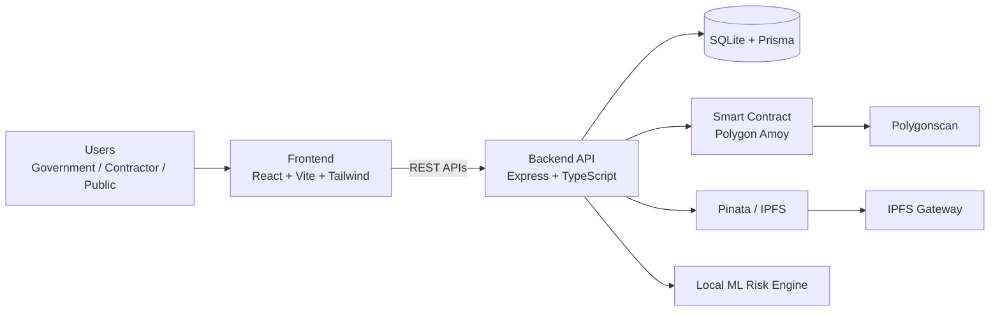
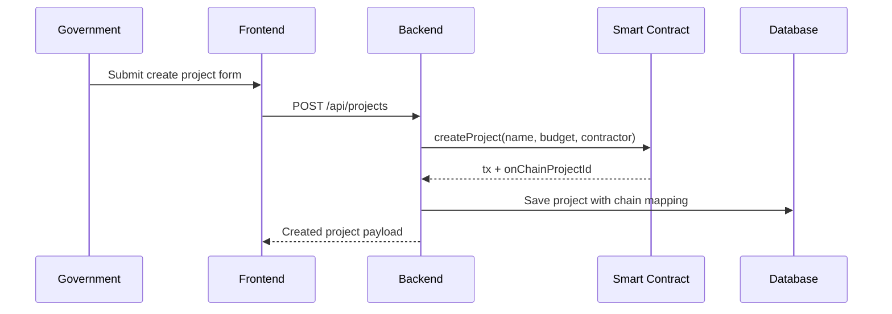
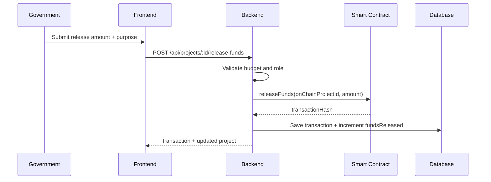
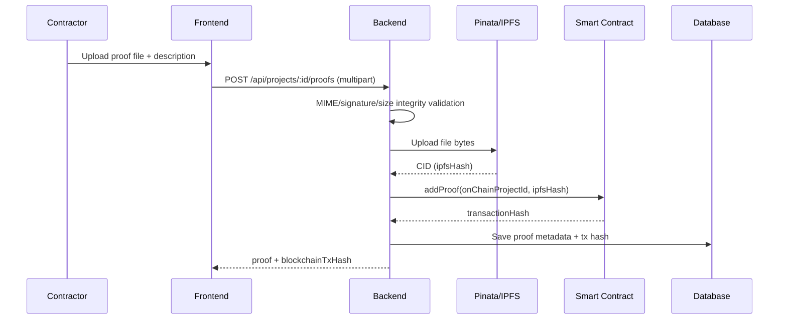
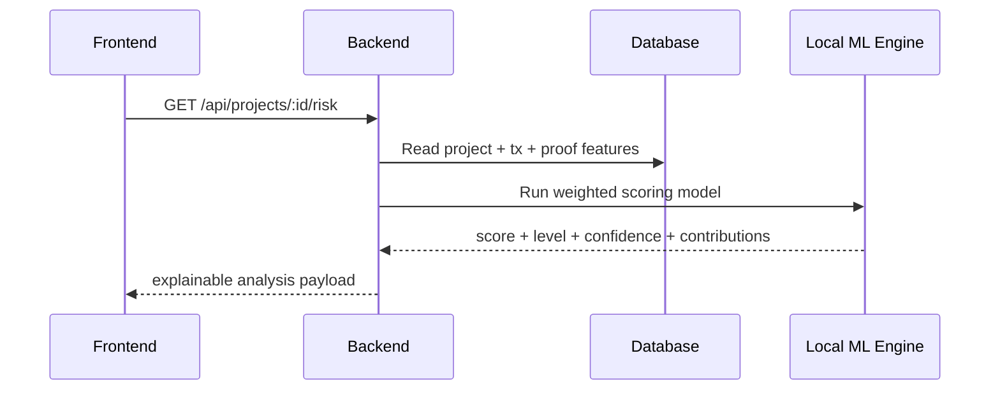

# InfraLedger Architecture Guide

## 1. Project Snapshot

InfraLedger is a transparency platform for public infrastructure monitoring.
It combines:
- role-based operations for government and contractors
- public visibility into project spending and proofs
- blockchain-backed financial/proof audit trail
- IPFS-based evidence storage
- explainable local ML risk engine

## 2. Architecture At A Glance

## 3. Layered Architecture

### 3.1 Frontend Layer

Responsibilities:
- authentication and route guards
- role-based action rendering
- dashboard and detail views
- completion/fund/proof user actions
- risk explainability display

Main technologies:
- React (component architecture)
- TypeScript (type safety)
- Axios (API client)
- Recharts (visual analytics)
- Tailwind CSS (design system)

### 3.2 Backend Layer

Responsibilities:
- API contracts and validations
- RBAC authorization checks
- DB persistence and query orchestration
- blockchain transaction execution
- IPFS upload pipeline
- risk model scoring and analysis payload generation

Main technologies:
- Express + TypeScript
- Prisma ORM
- Multer (multipart ingestion)
- Ethers.js (chain calls)

### 3.3 Decentralized Layer

Responsibilities:
- immutable tx records (fund release, proof recording)
- content-addressed proof storage

Main technologies:
- Solidity smart contract
- Polygon Amoy testnet
- Pinata + IPFS

## 4. Role Behavior Model

### 4.1 Government

Can:
- create projects
- release funds
- update completion percentage (including 100% completion)
- trigger manual project analysis
- manage user roles

### 4.2 Contractor

Can:
- upload work proofs for assigned projects
- submit evidence descriptions

### 4.3 Public

Can:
- view project dashboards
- inspect spending, risk, and proof history
- view explainable risk snapshots

## 5. Core Sequences

### 5.1 Create Project + On-chain Mapping

### 5.2 Release Funds

### 5.3 Proof Upload + IPFS + Chain

### 5.4 Explainable Risk Analysis

## 6. Data Model Summary

### 6.1 User

Key fields:
- id
- email
- displayName
- role
- organization

### 6.2 Project

Key fields:
- id / projectId
- totalBudget / fundsReleased
- completionPercentage
- riskScore / riskLevel
- blockchainProjectId
- status
- startDate / endDate

### 6.3 Transaction

Key fields:
- amount
- purpose
- releaseDate
- blockchainTxHash
- status

### 6.4 Proof

Key fields:
- fileName / fileType
- ipfsHash
- description
- aiAnalysisCompleted
- flaggedAnomalies

## 7. Blockchain Implementation Deep Dive

### 7.1 How transaction hash is produced

For each chain action:
1. Backend builds function call payload.
2. Wallet signs tx (private key from environment).
3. Signed tx is broadcast to Polygon RPC endpoint.
4. Network computes Keccak-256 transaction hash.
5. Hash is returned and stored in DB.

### 7.2 How proof hash is handled

1. Proof bytes are uploaded to IPFS via Pinata.
2. IPFS returns CID (content-addressed hash).
3. CID is recorded on-chain with project reference.
4. DB stores CID + on-chain tx hash for lookup and UI rendering.

### 7.3 Why this is tamper-evident

- CID changes if file content changes.
- Blockchain transaction history is immutable.
- Combining CID + tx hash gives strong auditability.

## 8. Explainable ML Risk Logic

Current model: local-ml-risk-v2

Input features include:
- funds released percentage
- completion percentage
- budget-progress gap
- proof count
- transaction count
- release frequency
- mean release size percentage
- elapsed timeline signal

Scoring method:
1. Normalize features.
2. Apply weighted linear contribution.
3. Add interaction boosts/penalties for risky patterns.
4. Apply sigmoid calibration.
5. Produce risk level thresholds:
- normal < 0.40
- medium 0.40 to < 0.70
- high >= 0.70

Explainability output includes:
- riskScore
- riskLevel
- confidence
- reasoning
- weighted feature contribution list
- anomaly notes
- data quality flag (sufficient/insufficient)

## 9. Security Model

### 9.1 Authentication and Authorization

- JWT bearer auth for protected operations
- role checks on sensitive routes
- public routes only for read-only transparency endpoints

### 9.2 Input Validation

- field-level validation for project creation, fund release, completion update
- strict bounds for completion percentage
- standardized error envelopes

### 9.3 File Safety

- MIME allow-list checks
- minimum file size checks
- magic-byte signature checks for JPG/PNG/PDF/DOCX

### 9.4 Secret Handling

- env-based credentials for blockchain/IPFS
- do not commit secrets
- use separate wallet for testnet ops

## 10. Deployment/Environment Notes

Development mode:
- SQLite local DB
- optional mock paths when chain/IPFS credentials are absent

Production-ready direction:
- PostgreSQL
- managed secret store
- queue-based async workers for heavy jobs
- observability and alerting

## 11. Roadmap By Phase

### Phase 1 (Current MVP)

- end-to-end project lifecycle
- blockchain + IPFS linkage
- explainable local risk model
- polished dashboard UX

### Phase 2 (Operational Hardening)

- milestone-based approval workflow
- multi-step fund release controls
- notifications and alerting
- richer analytics and trend views
- better pagination/filtering at scale

### Phase 3 (Advanced Governance)

- multisig approvals
- on-chain milestone escrow
- automated anomaly escalation
- audit report export (PDF/CSV)
- public open-data API packs

## 12. Suggested Next Features

1. Milestone engine with mandatory proof bundles.
2. SLA and delay-risk signals in the model.
3. Geo/time verification for field evidence.
4. Watchlists for high-risk projects.
5. Webhook events for external compliance systems.
