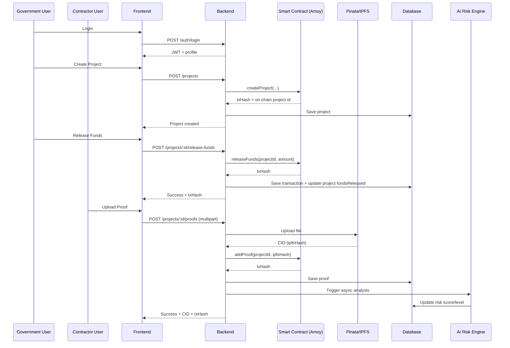

# InfraLedger

InfraLedger is a transparency-focused infrastructure tracking platform.
It combines:
- a public dashboard for citizens,
- role-based workflows for government and contractors,
- IPFS proof storage,
- blockchain-backed fund/proof records,
- AI risk scoring for project monitoring.

This repository is a monorepo with separate backend and frontend apps.

## 1. Tech Stack

Backend:
- Node.js + Express + TypeScript
- Prisma ORM
- SQLite (local dev)
- Ethers.js for Polygon Amoy integration
- Multer + Pinata API for IPFS file uploads

Frontend:
- React + TypeScript + Vite
- Axios
- Recharts
- Tailwind-based styling

Smart Contract:
- Solidity
- Hardhat
- Polygon Amoy testnet deployment target

## 2. Repository Structure

```text
Infra-Ledger/
├── backend/
│   ├── contracts/            # Solidity contracts
│   ├── scripts/              # Hardhat deploy scripts
│   ├── prisma/               # Prisma schema + local DB
│   └── src/
│       ├── routes/           # API routes
│       ├── services/         # Auth/IPFS/Blockchain/AI services
│       └── server.ts
├── frontend/
│   └── src/
│       ├── pages/
│       ├── components/
│       ├── services/
│       └── context/
├── architecture_roadmap.md
├── ux_screen_breakdown.md
└── SETUP_FREE_TIER.md
```

## 2.1 Architecture Diagrams

### System Architecture

```mermaid
flowchart LR
  U[Users<br/>Citizen / Government / Contractor] --> F[Frontend<br/>React + Vite]
  F -->|REST API (JWT)| B[Backend API<br/>Express + TypeScript]

  B --> DB[(SQLite via Prisma)]
  B --> IPFS[Pinata / IPFS]
  B --> CHAIN[Polygon Amoy<br/>InfraLedger Smart Contract]
  B --> AI[AI Risk Service<br/>Heuristic/Async]

  CHAIN --> EXPLORER[Polygonscan]
  IPFS --> GATEWAY[IPFS Gateway]

  subgraph Backend Modules
    R1[Auth Routes]
    R2[Project Routes]
    R3[User Routes]
    R4[Analytics Routes]
    S1[Auth Service]
    S2[Blockchain Service]
    S3[IPFS Service]
    S4[AI Service]
  end

  B --- R1
  B --- R2
  B --- R3
  B --- R4
  R1 --- S1
  R2 --- S2
  R2 --- S3
  R2 --- S4
```

### Core Workflow



## 3. Core Features

- Public project listing with analytics
- Project detail with transactions and proofs
- Government project creation and fund release
- Contractor proof upload with file validation
- Role-based access control
- Proof upload to IPFS (real Pinata mode or mock fallback)
- Blockchain tx recording for fund release and proofs (real or mock fallback)
- Gemini-based AI risk scoring with heuristic fallback and scheduled refresh

## 4. Prerequisites

- Node.js 20+
- npm
- Optional for real blockchain mode:
  - funded Polygon Amoy wallet
  - deployed InfraLedger contract address

## 5. Environment Configuration

### 5.1 Backend .env

Create `backend/.env` from `backend/.env.example`.

Recommended local values:

```env
PORT=4001
DATABASE_URL="file:./dev.db"
JWT_SECRET="dev-super-secret-jwt-key"

PINATA_API_KEY=""
PINATA_SECRET_API_KEY=""

POLYGON_RPC_URL="https://rpc-amoy.polygon.technology/"
CONTRACT_ADDRESS=""
PRIVATE_KEY=""

OPENAI_API_KEY=""
GEMINI_API_KEY=""
GEMINI_MODEL="gemini-2.0-flash-lite"
GEMINI_MAX_REQUESTS_PER_DAY=8
GEMINI_MIN_REQUEST_INTERVAL_MS=900000
GEMINI_QUOTA_COOLDOWN_MS=21600000
AI_CRON_INTERVAL_HOURS=6
```

Notes:
- Empty Pinata keys => mock IPFS hash fallback.
- Empty contract/private key => mock blockchain tx fallback.
- Empty Gemini key => heuristic AI fallback (fully local, no paid API).
- Scheduler runs heuristic-only by design to preserve Gemini free-tier quota.
- Gemini calls are throttled by daily cap, min interval, and quota cooldown.

### 5.2 Frontend .env

Create `frontend/.env`:

```env
VITE_API_BASE_URL=http://localhost:4001/api
```

## 6. Install and Run

### 6.1 Backend

```powershell
cd backend
npm install
npm run setup:free
npm run dev
```

Useful backend scripts:
- `npm run build`
- `npm run db:push`
- `npm run db:seed`
- `npm run prisma:generate`
- `npm run contract:compile`
- `npm run contract:deploy:amoy`

### 6.2 Frontend

```powershell
cd frontend
npm install
npm run dev
```

Fixed dev server port is configured to `5173`.

## 7. Demo Accounts

Seeded users:
- `gov@demo.com`
- `build@demo.com`
- `citizen@demo.com`

For current MVP auth route, password is not strictly validated against stored hashes.
Use `demo123` in UI examples.

## 8. API Overview

Auth:
- `POST /api/auth/login`
- `GET /api/auth/me`

Projects:
- `GET /api/projects`
- `GET /api/projects/:id`
- `POST /api/projects` (government)
- `POST /api/projects/:id/release-funds` (government)
- `POST /api/projects/:id/proofs` (contractor)
- `POST /api/projects/:id/analyze` (government)

Users:
- `GET /api/users` (government)
- `PUT /api/users/:id/role` (government)

Analytics:
- `GET /api/analytics`

## 9. Smart Contract Setup

Contract file:
- `backend/contracts/InfraLedger.sol`

Compile:

```powershell
cd backend
npm run contract:compile
```

Deploy to Amoy:

```powershell
cd backend
npm run contract:deploy:amoy
```

After deploy:
1. Copy deployed contract address.
2. Set `CONTRACT_ADDRESS` and `PRIVATE_KEY` in `backend/.env`.
3. Restart backend.

## 10. End-to-End Validation Flow

1. Start backend and frontend.
2. Login as government.
3. Create a project.
4. Release funds.
5. Login as contractor.
6. Upload a proof file.
7. Confirm:
- `ipfsHash` is real CID when Pinata keys are set.
- `blockchainTxHash` is non-mock when wallet + contract are configured and funded.

## 11. Troubleshooting

### Cannot load projects on frontend
- Verify backend URL in `frontend/.env`.
- Verify backend health:
  - `http://localhost:4001/health`

### Prisma EPERM on Windows
- Stop node processes holding Prisma engine DLL, then rerun:
  - `npm run prisma:generate`

### Vite port conflicts
- Port is fixed at 5173 with strict mode.
- Stop the process using 5173, then restart frontend.

### Proof upload fails with INSUFFICIENT_FUNDS
- Fund the wallet from `PRIVATE_KEY` on Polygon Amoy.
- Confirm balance of the same wallet used by backend.

### Mock tx/hash still appearing
- Ensure `CONTRACT_ADDRESS` and `PRIVATE_KEY` are set.
- Restart backend after `.env` edits.

### AI still using heuristic mode
- Ensure `GEMINI_API_KEY` is set in `backend/.env`.
- Optionally set `GEMINI_MODEL` (default: `gemini-2.0-flash-lite`).
- Restart backend after `.env` changes.

## 12. Security Notes

- Never commit real secrets in `.env` files.
- Rotate exposed API keys immediately if accidentally shared.
- Use scoped Pinata keys with minimum required permissions.
- Use a dedicated low-risk dev wallet for testnet.

## 13. Project Documents

- `architecture_roadmap.md`: phased integration plan
- `ux_screen_breakdown.md`: full screen-level UX spec
- `SETUP_FREE_TIER.md`: free-first setup guide
