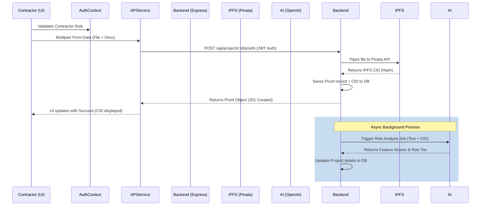

# Architecture Roadmap & Implementation Plan

This document outlines the architectural roadmap for connecting the newly built InfraLedger React Frontend to the production backend services specified in the PRD and TRD. This roadmap is optimized for controlled execution, mitigating risks in decentralized infrastructure and AI integration.

## 1. Folder Structure Breakdown (Analyzed)

The frontend is currently structured for scalable, layered separation of concerns.

```text
frontend/src/
├── components/       # Component Library
│   ├── admin/        # Admin-specific UI (UserTable)
│   ├── dashboard/    # HeroBanner, Stats, Flagged Projects, QuickActions
│   ├── forms/        # Stateful forms (Login, CreateProject, UploadProof, FundRelease)
│   ├── layout/       # App shell components (TopBar, Footer, PageLayout)
│   ├── project/      # Smart & Presentation components for Project domain (BudgetCard, Timeline)
│   ├── routing/      # Auth & Role guards
│   └── ui/           # Dumb primitives (Button, DropZone, Recharts Wrappers, Skeletons)
├── constants/        # Centralized Enums, Routes, API bases, and Risk Thresholds
├── context/          # React Contexts (AuthContext, ToastContext)
├── hooks/            # Custom reusable hooks (usePolling, useToast)
├── pages/            # Top-level route containers orchestrating components
├── services/         # Axios instance and API interaction layer (currently mocked)
├── types/            # Strict TypeScript interfaces matching TRD data models
└── utils/            # Pure formatting and transformation utilities
```

## 2. Backend Wiring Order

To ensure a smooth transition from mocked services to the live backend, implement the wiring in this progressive order. Dependencies must be satisfied layer-by-layer.

1. **Phase 1: Authentication & RBAC Layer**
   - **Wire:** `POST /api/auth/login`, `GET /api/auth/me`
   - **Action:** Replace hardcoded [AuthContext](file:///d:/Infra-Ledger/frontend/src/context/AuthContext.tsx#7-15) demo credentials with actual JWT receipt, storage (HttpOnly cookie favored, but in-memory acceptable for V1), and user hydration.
   - **Admin:** Wire `GET /api/users` and `PUT /api/users/:id/role`.

2. **Phase 2: Core Read Paths (Idempotent)**
   - **Wire:** `GET /api/projects`, `GET /api/projects/:id`, `GET /api/analytics`
   - **Action:** Remove mock arrays in [services/api.ts](file:///d:/Infra-Ledger/frontend/src/services/api.ts). Connect [usePolling](file:///d:/Infra-Ledger/frontend/src/hooks/usePolling.ts#4-32) hooks directly to real data. Ensure the Pagination implementation respects the backend's cursor/offset format.

3. **Phase 3: Relational Write Paths (PostgreSQL)**
   - **Wire:** `POST /api/projects`
   - **Action:** Connect the [CreateProjectForm](file:///d:/Infra-Ledger/frontend/src/components/forms/CreateProjectForm.tsx#13-146). Handle API validation errors by mapping 400 response bodies to the existing UI error states.

4. **Phase 4: Decentralized Write Paths (IPFS & Polygon)**
   - **Wire:** `POST /api/projects/:id/proofs` (Multipart form-data)
   - **Action:** Wire [DropZone](file:///d:/Infra-Ledger/frontend/src/components/ui/DropZone.tsx#17-123) and [UploadProofForm](file:///d:/Infra-Ledger/frontend/src/components/forms/UploadProofForm.tsx#14-95). The backend will stream the file to Pinata (IPFS). The frontend must handle the potentially longer latency of IPFS pinning.
   - **Wire:** `POST /api/projects/:id/release-funds`
   - **Action:** Wire the [FundReleaseModal](file:///d:/Infra-Ledger/frontend/src/components/forms/FundReleaseModal.tsx#19-144). The backend must relay the transaction to Polygon Amoy/Mumbai and return the transaction hash.

5. **Phase 5: AI Integration (Webhooks/Polling)**
   - **Wire:** Wait for AI webhooks or poll `GET /api/projects/:id` for updated `riskScore`.
   - **Action:** Ensure the UI gracefully handles `riskScore === null` while the background OpenAI agent processes the IPFS proof.

## 3. State Management Plan

The current architecture intentionally avoids Redux/Zustand in favor of React primitives. For V1 production wiring, this will evolve as follows:

| State Domain | Tooling | Justification |
| :--- | :--- | :--- |
| **Global UI State** | React Context ([ToastContext](file:///d:/Infra-Ledger/frontend/src/context/ToastContext.tsx#21-26)) | Minimal footprint, highly localized to the app shell. |
| **Authentication** | React Context ([AuthContext](file:///d:/Infra-Ledger/frontend/src/context/AuthContext.tsx#7-15)) | Read-heavy, rarely mutated. Avoids prop-drilling roles to guards. |
| **Server State (Async)** | SWR / React Query | Replaces current [usePolling](file:///d:/Infra-Ledger/frontend/src/hooks/usePolling.ts#4-32). Crucial for caching, deduping requests, and background refetching (essential for the AI processing delays). |
| **Local Form State** | `useState` + Client Validation | Forms are short-lived. Validation is simple enough to not require `react-hook-form` yet. |

## 4. Data Flow Mapping

Understanding the complete lifecycle of the most complex operation: **Uploading a Proof (Contractor)**.



## 5. Risk Areas & Mitigations

When connecting the real backend, these are the critical failure points you must engineer around:

### Risk 1: Blockchain Transaction Latency
- **Problem:** When releasing funds, the Ethers.js transaction on Polygon Amoy may take 10-30 seconds to finalize.
- **Mitigation:** The [FundReleaseModal](file:///d:/Infra-Ledger/frontend/src/components/forms/FundReleaseModal.tsx#19-144) must implement a distinct "Blockchain Confirming..." spinner state. The backend should ideally return a standard [pending](file:///d:/Infra-Ledger/frontend/src/components/project/SpendingTimeline.tsx#10-54) transaction immediately and resolve it via webhooks or polling, rather than holding the HTTP request open until block finality.

### Risk 2: IPFS Upload Timeouts
- **Problem:** Uploading large image proofs (up to 10MB) via the backend to Pinata can timeout standard Vercel/Render serverless functions (limitations typically ~10s).
- **Mitigation:** Ensure the Express backend uses aggressive streaming (`multer` -> Pinata stream) without buffering the file entirely in RAM. Increase the API gateway timeout threshold on the specific `/api/projects/:id/proofs` route.

### Risk 3: AI Analysis Asynchrony
- **Problem:** The AI risk analysis happens *after* proof upload. The user might refresh the page and see the old risk score.
- **Mitigation:** The frontend polling mechanism (`SWR` / [usePolling](file:///d:/Infra-Ledger/frontend/src/hooks/usePolling.ts#4-32)) must trigger an immediate refetch when navigating back to the [PublicDashboard](file:///d:/Infra-Ledger/frontend/src/pages/PublicDashboard.tsx#17-103) or [ProjectDetail](file:///d:/Infra-Ledger/frontend/src/pages/ProjectDetail.tsx#20-137) view. The UI already has a "Not Analyzed" fallback state for [RiskCard](file:///d:/Infra-Ledger/frontend/src/components/project/RiskCard.tsx#19-53).

## 6. Execution Dependency Order

To execute this plan smoothly, follow this strict dependency DAG (Directed Acyclic Graph):

1. **Deploy Databases:** Spin up PostgreSQL (Supabase/Neon). Run Prisma migrations.
2. **Configure API Keys:** Add Pinata (`PINATA_API_KEY`), Polygon RPC URL (`POLYGON_URL`), and OpenAI (`OPENAI_API_KEY`) to the backend environment.
3. **Backend Stubbing:** Create empty router endpoints for the 5 phases defined above.
4. **Integration Phase 1 & 2:** Wire Auth and Read endpoints. Validate with frontend.
5. **Integration Phase 3:** Wire relational writes (Create Project).
6. **Smart Contract Config:** Deploy the minimal fund ledger contract to Polygon Amoy. Note the contract address.
7. **Integration Phase 4:** Wire heavy processes (IPFS and Transactions).
8. **E2E Testing:** Perform full pipeline E2E tests from login -> project creation -> fund release -> proof upload.
